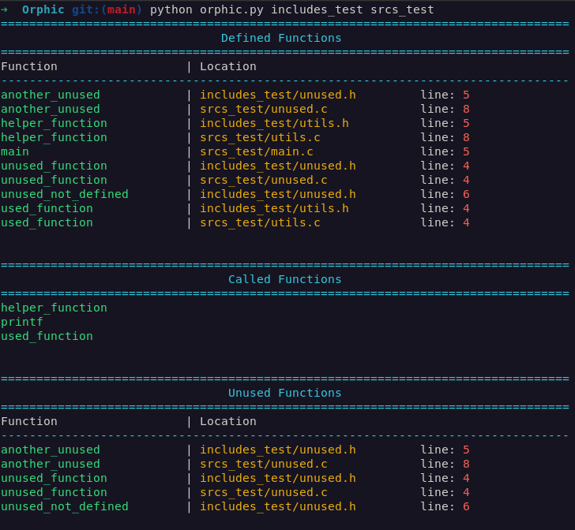

# Orphic

**Orphic** is a lightweight Python tool designed to detect orphan (unused) functions in C projects.
By scanning directories or individual source files, Orphic extracts function definitions (with file paths and line numbers) and identifies which functions are never called. This helps developers clean up their code, remove dead code, and maintain a lean, efficient codebase.

---

## Features

- **Recursive Scanning:**
  Automatically traverses directories to process all `.c` and `.h` files.

- **Accurate Extraction:**
  Uses regular expressions to detect function definitions and calls, while filtering out comments to avoid false positives.

- **Detailed Reporting:**
  Outputs a formatted table displaying:
  - Function name
  - File location (path and line number)
  - Lists of called functions and orphan (unused) functions

- **Flexible Input:**
  Supports scanning multiple directories and/or files passed as command-line arguments.



---

## Installation

1. **Clone the repository:**
   ```bash
   git clone https://github.com/yourusername/orphic.git
   cd orphic
   ```

2. **Ensure you have Python 3 installed.**
   No additional dependencies are required.

---

## Usage

Run Orphic from the command line by specifying one or more directories or files to scan:

```bash
python orphic.py srcs includes
```

- If no input is provided, the script will display an appropriate message and exit.
- The script will output a summary of defined functions, called functions, and orphan (unused) functions.

---

## Contributing

Contributions are welcome! Feel free to open issues or submit pull requests to help improve Orphic.

---


**Orphic** is named to evoke the idea of "orphaned" functions—those pieces of code left unused in your project. Clean up your codebase and make maintenance easier with Orphic!